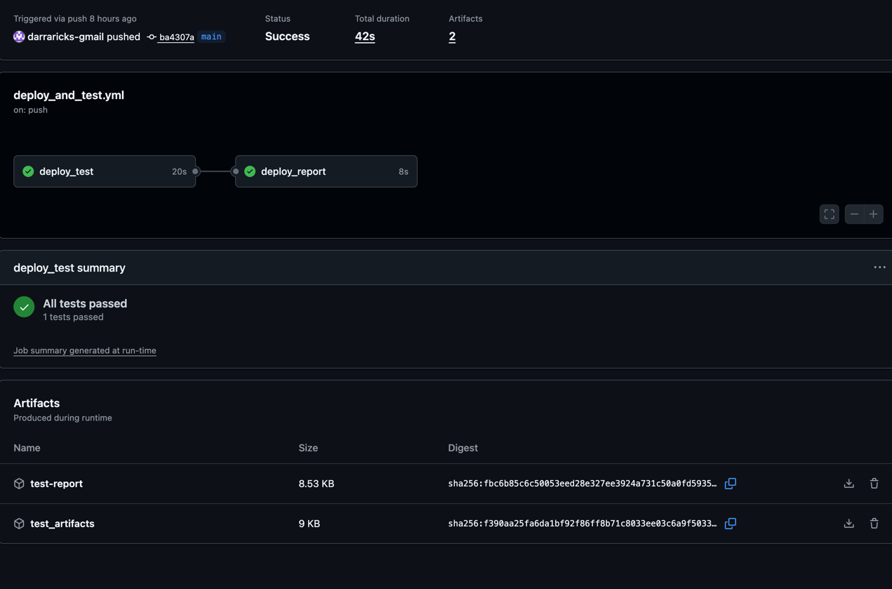
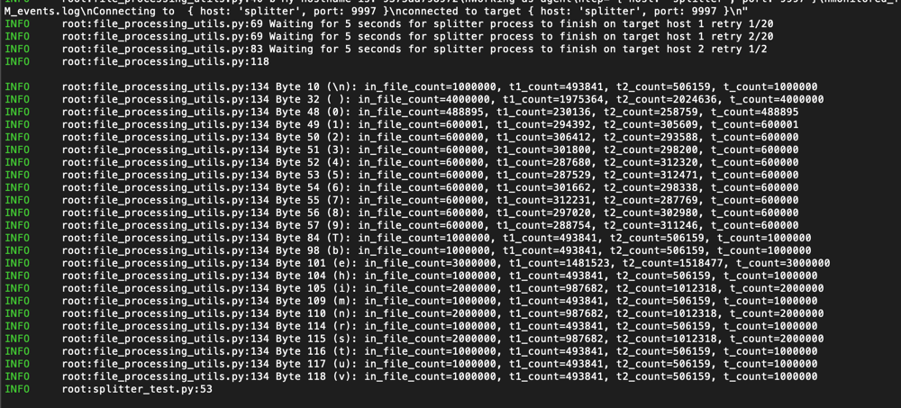

## Purpose
   This repo contains a test setup that verifies file input data is processed sufficiently via the following application

   **Agent:** Reads from a specified file and forwards the contents to a ‘Splitter’

   **Splitter:** - Receives data from an ‘Agent’ and randomly splits the data between the two configured ‘Target’ hosts

   **Target:** Receives data from a ‘Splitter’ and writes it to a file on disk

   The application is deployed using docker. Each component the  Agent, Splitter and two Targets run in individual docker containers.  A test
   container is also created and deployed with th application

## Project Highlights  

-  The application agent service is driven via the test harness using a volume shared between application containers.  This way the test harness can iterate through any set of data scenarios given a set of files and update the necessary configuration files used by the application containers

- Each test case is associated with a specific data scenario
  
-  A "Deploy and Test" Github Action workflow automatically triggers and deploys the application and tests it.  This workflow is triggered by any push to the main branch and also uses the test result outcome to gate pull requests to main branch
  
- Target host output events.log artifacts are timestamped and stored for reference to each test run
  
- Test logs show bytes character counts used in test verification
  
- Published test report after each Deploy and Test workflow triggered by main branch changes only.  Report can be found at: https://darraricks-gmail.github.io/splitter/

## Prerequisites 

To run this project locally, ensure 'docker' and 'docker compose' are installed on your machine

**To verify docker installation:**
   
   docker --version
   
**To verify docker compose installation:** 

  docker compose version

If you find docker is not installed you can download an installation file for Docker Desktop: https://www.docker.com/products/docker-desktop/

Once installed, repeat the verification steps

## Deploying Application and Test Containers

Verify the Docker daemon has started.  To do this make sure your Docker Desktop application is launched

Once you have docker running go to the root of the project directory you will see a docker-compose.yml file in this directory run:

  docker compose up --build -d

**To run test set run the following also in the root directory:**

docker compose exec tests pytest -v

After the test run is complete you can retrieve the test artifacts in the /test_artifacts directory

**Tear Down Application and Test Containers**

docker compose down  

**Troubleshooting:**

On occasion after many docker builds and deploys you might start to see various "file not found" errors in the test logs if this starts to occur
consistently try tearing down the deployment container along with deleting the volumes as well, just remember all data associated with them will be wiped:

docker compose down -v

then deploy again

docker compose up --build -d

## Test Strategy

**High Level Directory Structure**

- app/ :   contains all application code files that the agent, splitter and targets need to run, each of these component directories contain a Dockerfile for container build

- html_report_pkg:   used for github pages publish, it contains index.html that points to the report.html

- ingestion_io:    io volume directory the agent, targets and test containers share

- ingestion_io/input_files:     contains all test input files used in test set it is visible to agent and test container

- ingestion_io/output_split_data:  updated as each target receives split file data, it is mapped to each target's container events.log, the test container empties the events.logs at the beginning of each test and the targets write new file data

- ingestion_io/input_monitor_file_path.json:  updated by tests to specify the input file the agent reads from

- test_artifacts/   all test artifacts for tests run

- tests/ :  Dockerfile for test container and all related python test code and configuration files

- docker-compose.yml

   The agent application sends only one specified file at a time each time node ./app.js ./ is executed. In order to run multiple test scenarios in a test run the
test harness is setup to drive the agent application by updating the input file configuration the agent app reads from(./app/agent/inputs.json).
This is done from the test container by updating the input_monitor_file_path.json file stored on the shared docker volume bound to the agents input.json file

 Test Setup steps:
   1. Update the input file configuration the agent app reads from ./app/agent/inputs.json.  This is done from the test container by updating the input_monitor_file_path.json file stored on the shared docker volume 
   2. Run the node command for the agent to initialize file processing, this is done by binding the test container's docker daemon socket to the local machine host docker daemon to send the node command directly in agent's container
   3. Monitors shared volume ingestion_io/output_split_data/target*/events.log files until data is no longer being added to logs
   4. Event log data verificaton ( explained in the following Test Cases section)

## Test Cases

**Verfication:  **

   Verify each test case file is processed correctly by capturing the counts of each byte value in the test input file then comparing that count to the 
   same byte values on target host files. The sum of the counts of each byte value in the target host files should equal the totals in the original
   input file

 **Test Case Set:**
 
   1.    test_random_char_lines.txt: Contains lines of random lengths and a wide variety of characters.
         captures data loss  since the distribution of each byte value should be highly varied and unique

   2.    large_1M_events.log: verifies application can process large files without timeouts, performances issues or data loss
     
   3.    test_empty_file: verifies application can process empty files without errors or crashing
     
   4-7.  test_image.jpg,png,pdf": verifies application can process binary without data loss and application errors
   
   8.    test_two_files_ingested_wo_clearing_eventslog:  validates  when data from more than one file is sent without clearing events.logs, data from each input file still is not lost or corrupted

## Test Artifacts

After executing a test run from your local machine a test artifact directory will be created

/splitter/test_artifacts will contain a timestamped directory for each test run containing:

   - a events.log file for each target host can be found named according to the target host # and the input test file
     used 

  - an html test report of last run

  
Test Report of latest Github action Deploy and Test can be found at: https://darraricks-gmail.github.io/splitter/

Also at the bottom summary section of each github action test workflow run is a:

- test summary of the amount of tests that passed and failed
- downloadable zipped copy of the test_artifacts directory described above
- report.html downloadable artifact

  

## Test Logging Output
- Highlights byte count validations
- Shows progress of file processing from monitoring shared volume between target hosts and test container, the tests wait for events.log updates to complete 
  
As explained in the test strategy section, data for each file is validated by counting the number of occurrences of each byte value, the logs will
show the byte value count of the original input file and the sum of the byte value counts from the target host events.logs

So in the example below the byte value 101 ASCII 'e' has the correct t_count (total count) of 'e' since t_count=t1_count +t2_count==in_file_count

 Byte 101 (e): in_file_count=3000000, t1_count=1481523, t2_count=1518477, t_count=3000000 

 

